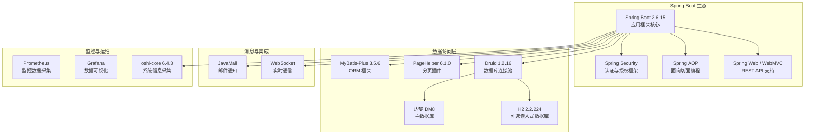
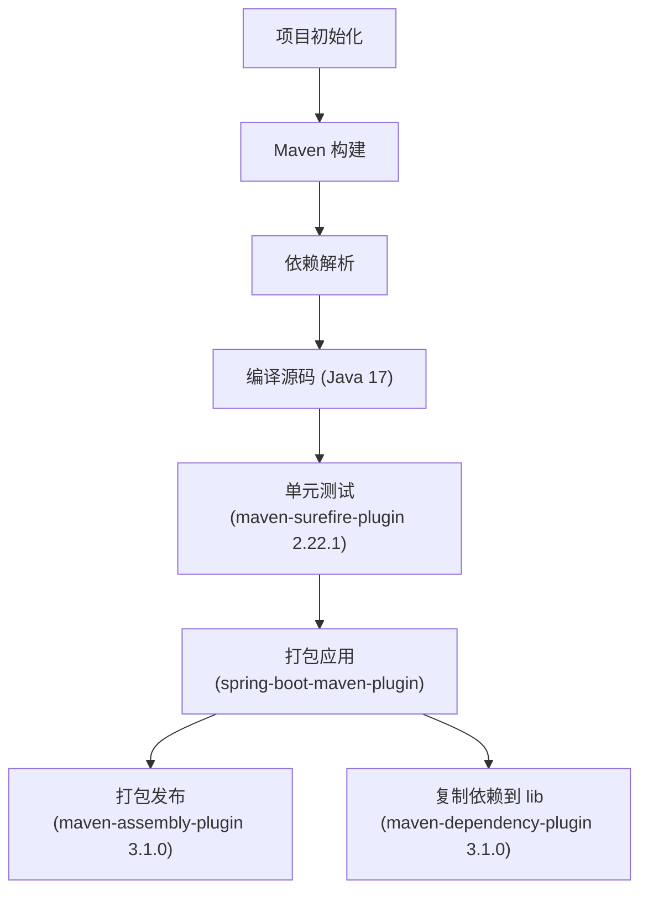
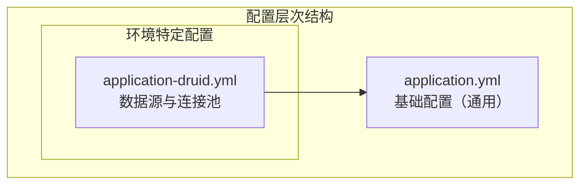
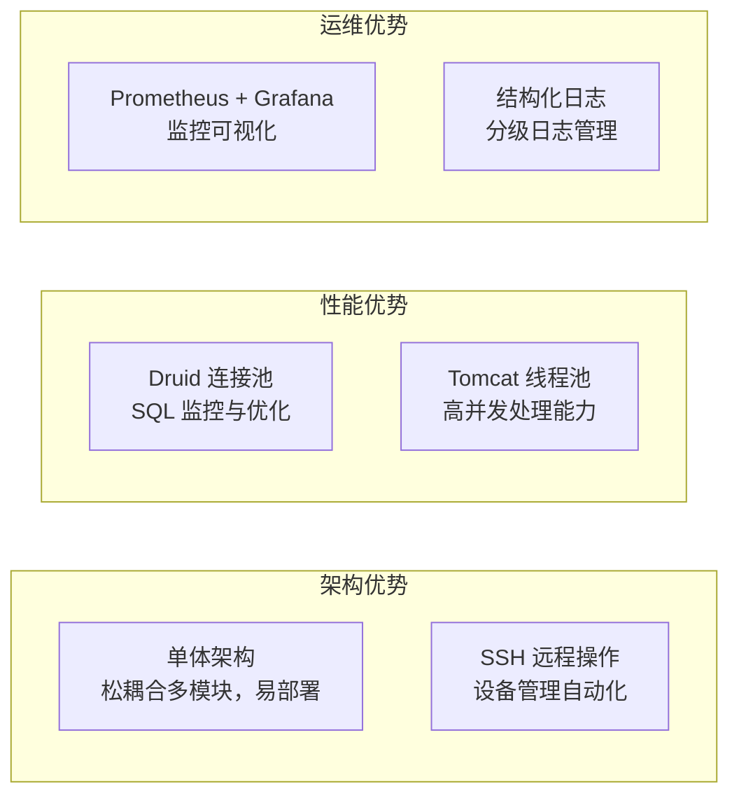

# 技术栈与依赖

**本文档引用的文件**
- [README.md](../../README.md)
- [pom.xml](../../pom.xml)
- [ncdb-admin/pom.xml](../../ncdb-admin/pom.xml)
- [ncdb-common/pom.xml](../../ncdb-common/pom.xml)
- [ncdb-system/pom.xml](../../ncdb-system/pom.xml)
- [ncdb-device/pom.xml](../../ncdb-device/pom.xml)
- [NcdbApplication.java](../../ncdb-admin/src/main/java/com/dm/cn/NcdbApplication.java)
- [application.yml](../../ncdb-admin/src/main/resources/application.yml)
- [application-druid.yml](../../ncdb-admin/src/main/resources/application-druid.yml)
- [ThreadPoolConfig.java](../../ncdb-common/src/main/java/com/dm/cn/common/config/manager/ThreadPoolConfig.java)
- [ncdb-ui/package.json](../../ncdb-ui/package.json)
- [ncdb-ui/vite.config.js](../../ncdb-ui/vite.config.js)

## 目录
1. [项目概述](#项目概述)
2. [核心技术栈](#核心技术栈)
3. [构建与依赖管理](#构建与依赖管理)
4. [配置管理](#配置管理)
5. [技术选型分析](#技术选型分析)

## 项目概述

本项目（NCDB 管理系统，内部名称为 `manager`）是一个基于 **Spring Boot 2.6.15** 的单体架构应用，以 **达梦数据库 DM8** 作为主存储，面向设备管理与运维监控场景。项目采用 Maven 多模块组织方式，Java 版本为 **17**，依赖中间件为 **DM8**。来源：[README.md](../../README.md)、[pom.xml](../../pom.xml)

### 核心特性
- **单体架构，易维护易部署** — 简化部署与运维流程
- **SSH 远程操作与 Shell 脚本执行** — 通过 SSH 远程调用设备 Shell 脚本，支持设备配置、升级与监控
- **达梦数据库（DM8）支持** — 使用达梦数据库作为主存储，通过 MyBatis-Plus 进行数据访问
- **设备全生命周期管理** — 支持设备注册、节点管理、资源监控、告警配置等
- **CAS 单点登录集成** — 支持 CAS 认证协议，可通过配置开启
- **Prometheus 监控集成** — 内置 Prometheus 与 Grafana 监控组件管理能力

来源：[README.md](../../README.md)、[application.yml](../../ncdb-admin/src/main/resources/application.yml)、[application-druid.yml](../../ncdb-admin/src/main/resources/application-druid.yml)

## 核心技术栈

### Spring Boot 生态系统

**图表来源**
- [pom.xml](../../pom.xml)
- [ncdb-common/pom.xml](../../ncdb-common/pom.xml)
- [NcdbApplication.java](../../ncdb-admin/src/main/java/com/dm/cn/NcdbApplication.java)

### 技术选型详解

#### Spring Boot 2.6.15
- **版本选择原因**：企业级主流稳定版本，提供完善的自动配置、健康检查、外部化配置等特性；与 Spring Security、MyBatis-Plus 等组件兼容性良好。
- **核心功能**：自动配置、嵌入式 Tomcat 服务器、外部化配置管理、健康检查、指标监控、日志集成。
- **应用场景**：作为项目基础框架，支撑所有后端服务的运行与配置管理。

#### Spring Security + JWT
- **认证授权**：基于 Spring Security 框架实现用户认证与授权，支持 `@PreAuthorize` 方法级权限控制。来源：[NcdbApplication.java](../../ncdb-admin/src/main/java/com/dm/cn/NcdbApplication.java)
- **安全控制**：通过 JWT Token 进行无状态认证，令牌自定义标识为 `Authorization`，有效期 300 分钟，使用自定义密钥签名。来源：[application.yml](../../ncdb-admin/src/main/resources/application.yml)
- **会话管理**：支持 CAS 单点登录集成，可通过 `app.casEnable` 配置开关控制。来源：[application.yml](../../ncdb-admin/src/main/resources/application.yml)

#### MyBatis-Plus 3.5.6
- **优势**：增强 MyBatis 功能，提供代码生成器、条件构造器、分页插件等开箱即用特性，减少样板代码。
- **使用场景**：全系统数据访问层，通过 `@MapperScan("com.dm.cn.**.mapper")` 自动扫描 Mapper 接口。来源：[NcdbApplication.java](../../ncdb-admin/src/main/java/com/dm/cn/NcdbApplication.java)
- **配置特点**：配置了 MyBatis-Plus 分页拦截器，根据数据库类型（DM 或 H2）自动选择分页方言。来源：[NcdbApplication.java](../../ncdb-admin/src/main/java/com/dm/cn/NcdbApplication.java)(L56-L61)

#### Druid 1.2.16 连接池
- **缓存策略**：阿里巴巴数据库连接池，提供连接池监控、SQL 分析、慢查询日志等功能。
- **数据结构**：配置了初始连接数 5、最小空闲 5、最大活跃 20、连接等待超时 60 秒；开启预处理语句缓存（`maxPoolPreparedStatementPerConnectionSize: 20`）。来源：[application-druid.yml](../../ncdb-admin/src/main/resources/application-druid.yml)
- **持久化**：配置了 `stat` 和 `slf4j` 过滤器，启用 SQL 合并统计与慢 SQL 监控（慢 SQL 阈值 5000ms）。

#### Jasypt 配置加密
- **加密策略**：使用 `PBEWithMD5AndDES` 算法对配置文件中的敏感信息（如数据源密码）进行加密。来源：[application.yml](../../ncdb-admin/src/main/resources/application.yml)(L234-L237)
- **使用场景**：通过 `@EnableEncryptableProperties` 注解启用配置加密功能，用于保护数据源密码等敏感配置项。来源：[NcdbApplication.java](../../ncdb-admin/src/main/java/com/dm/cn/NcdbApplication.java)(L33)

**章节来源**
- [pom.xml](../../pom.xml)
- [NcdbApplication.java](../../ncdb-admin/src/main/java/com/dm/cn/NcdbApplication.java)
- [application.yml](../../ncdb-admin/src/main/resources/application.yml)
- [application-druid.yml](../../ncdb-admin/src/main/resources/application-druid.yml)

## 构建与依赖管理

### Maven 构建系统

项目采用 **Maven** 作为构建工具，通过 `maven-compiler-plugin` 3.1 进行编译，Java 版本为 17，配合父子模块结构管理多模块构建。

**图表来源**
- [pom.xml](../../pom.xml)
- [ncdb-admin/pom.xml](../../ncdb-admin/pom.xml)

### 依赖管理策略

#### 核心依赖版本
- **JDK 17**: 项目编译与运行环境，支持 records、密封类、模式匹配等现代 Java 特性。来源：[pom.xml](../../pom.xml)
- **Spring Boot 2.6.15**: 应用框架核心，提供自动配置、健康检查、嵌入式服务器等能力。来源：[pom.xml](../../pom.xml)
- **MyBatis-Plus 3.5.6**: ORM 框架，增强 MyBatis 的分页、条件构造、代码生成功能。来源：[ncdb-common/pom.xml](../../ncdb-common/pom.xml)
- **Druid 1.2.16**: 数据库连接池，提供连接池监控、SQL 分析、慢查询日志。来源：[pom.xml](../../pom.xml)
- **达梦 DM8**: 主数据库，国产关系型数据库，使用 `DmJdbcDriver18 8.1.3.62` 驱动。来源：[ncdb-common/pom.xml](../../ncdb-common/pom.xml)

#### 依赖升级策略
1. **渐进式升级**: 依赖版本统一在父 POM 的 `<properties>` 中管理，升级时仅需修改版本号一处。
2. **向后兼容**: 通过 `<dependencyManagement>` 统一管理版本，确保各模块使用一致的依赖版本。
3. **性能评估**: 连接池、线程池等核心参数可在配置文件中调整，便于升级后进行性能调优。
4. **回滚计划**: 通过 Maven 版本管理，可快速回退至先前的稳定版本。

**章节来源**
- [pom.xml](../../pom.xml)
- [ncdb-common/pom.xml](../../ncdb-common/pom.xml)
- [ncdb-admin/pom.xml](../../ncdb-admin/pom.xml)

## 配置管理

### 配置文件结构

项目采用 **Spring Boot 标准多环境配置** 风格，以 `application.yml` 为基础配置文件，通过 `spring.profiles.active` 激活特定环境配置：

**图表来源**
- [application.yml](../../ncdb-admin/src/main/resources/application.yml)
- [application-druid.yml](../../ncdb-admin/src/main/resources/application-druid.yml)

### 环境配置详解

#### 基础配置（application.yml）
- **服务器端口**: 1081，上下文路径为 `/`
- **Tomcat 配置**: 最大线程数 800，最小空闲线程 100，连接排队数 1000，URI 编码 UTF-8
- **文件上传限制**: 单个文件最大 10GB，总上传大小最大 10GB
- **日志配置**: `com.dm.cn.base` 和 `com.dm.cn.system` 包日志级别为 `debug`，`org.springframework` 为 `warn`
- **JWT Token 配置**: 自定义标识 `Authorization`，有效期 300 分钟
- **MyBatis 配置**: 别名包 `com.dm.cn.**.domain`，Mapper 位置 `classpath*:mapper/**/*Mapper.xml`
- **PageHelper 分页**: 方言为 `mysql`（兼容达梦数据库）
- **Swagger 配置**: 开启状态，路径映射 `/dev-api`
- **XSS 过滤**: 开启状态，排除链接 `/system/notice`，匹配链接 `/system/*,/monitor/*,/ncdb/*,/ws/*`
- **SSH 连接池**: 最大连接数 10000，每个 key 最大 500，空闲连接 30 分钟剔除
- **Prometheus 监控**: 安装路径 `/opt/prometheus`，组件启动超时 30 秒
- **CAS 配置**: 单点登录地址 `http://10.14.2.25:8888/cas`，默认关闭
- **Jasypt 加密**: 使用 `PBEWithMD5AndDES` 算法，配置 `NoIvGenerator`

来源：[application.yml](../../ncdb-admin/src/main/resources/application.yml)

#### 数据源配置（application-druid.yml）
- **数据库**: 达梦 DM8，驱动 `dm.jdbc.driver.DmDriver`
- **连接 URL**: `jdbc:dm://localhost:5236?schema=TEST_SCAFFOLD`
- **用户名/密码**: SYSDBA / Dameng@8888（已脱敏）
- **连接池参数**:
  - 初始连接数: 5
  - 最小空闲连接: 5
  - 最大活跃连接: 20
  - 连接等待超时: 60 秒
  - 空闲连接检测: `SELECT 1 FROM DUAL`
  - 预处理语句缓存: 启用，每个连接最大 20 条
  - 慢 SQL 阈值: 5000ms

来源：[application-druid.yml](../../ncdb-admin/src/main/resources/application-druid.yml)

#### 前端配置（ncdb-ui）
- **构建工具**: Vite 5.3.2，开发服务器端口 80
- **API 代理**: `/dev-api` 转发至 `http://localhost:1081`，WebSocket 代理至 `ws://10.167.20.31:1081`
- **环境变量**: 开发环境 API 基础路径 `/dev-api`，WebSocket 路径 `/websocket`

来源：[ncdb-ui/vite.config.js](../../ncdb-ui/vite.config.js)、[ncdb-ui/.env.development](../../ncdb-ui/.env.development)

#### 配置加载优先级
1. 环境变量（最高优先级）
2. 环境特定配置文件（`application-druid.yml`）
3. 基础配置文件（`application.yml`）
4. 默认值（最低优先级）

**章节来源**
- [application.yml](../../ncdb-admin/src/main/resources/application.yml)
- [application-druid.yml](../../ncdb-admin/src/main/resources/application-druid.yml)
- [ncdb-ui/vite.config.js](../../ncdb-ui/vite.config.js)
- [ncdb-ui/.env.development](../../ncdb-ui/.env.development)

## 技术选型分析

### 为什么选择这些技术？

#### Spring Boot vs 传统框架
- **快速开发**: 自动配置、起步依赖、嵌入式服务器，大幅减少项目初始化配置
- **生态丰富**: 与 Spring Security、MyBatis-Plus、Druid 等企业级组件无缝集成
- **运维友好**: 内置健康检查、指标监控、外部化配置，便于生产环境运维

#### MyBatis-Plus vs 原生 MyBatis
- **性能优势**: 保留 MyBatis 原生 SQL 映射能力，同时提供通用 CRUD 操作，减少重复代码
- **类型安全**: 通过 Lambda 条件构造器实现类型安全的查询构建，避免拼写错误
- **复杂查询**: 支持分页插件、乐观锁插件、逻辑删除等实用功能

#### 达梦 DM8 vs 其他数据库
- **国产化需求**: 满足信创国产化数据库要求，适配国内企业级应用场景
- **兼容性**: 与 MySQL/Oracle 语法高度兼容，降低迁移成本；PageHelper 配置 `mysql` 方言即可运行
- **生态集成**: 通过 MyBatis-Plus 动态数据源支持，可实现达梦与 H2 数据库切换

#### JWT vs 传统 Session
- **无状态**: 不依赖服务器端会话存储，便于水平扩展和微服务化
- **跨域支持**: 天然支持跨域认证，适合前后端分离架构
- **安全控制**: 可通过自定义过滤器实现 Token 刷新、黑名单等增强安全策略

### 技术组合的优势

**章节来源**
- [pom.xml](../../pom.xml)
- [README.md](../../README.md)
- [application.yml](../../ncdb-admin/src/main/resources/application.yml)
- [application-druid.yml](../../ncdb-admin/src/main/resources/application-druid.yml)