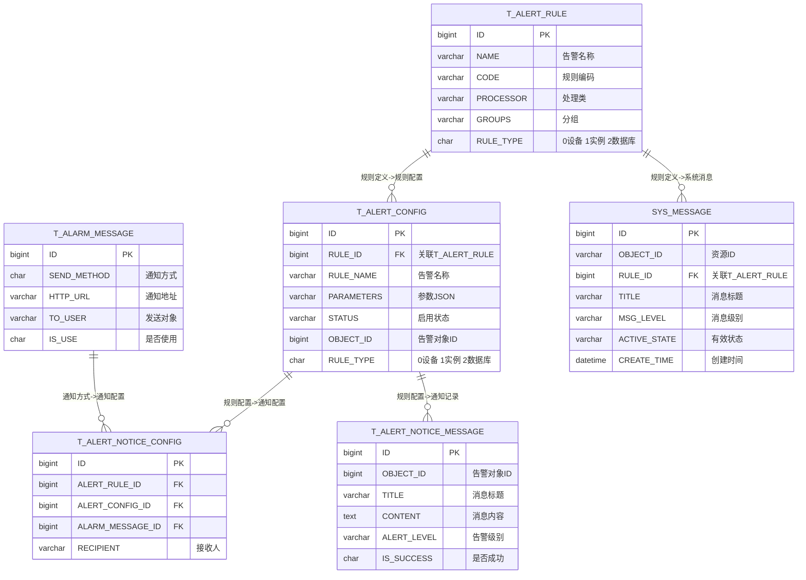

# 告警消息数据模型

## 概述

告警消息数据模型涵盖告警规则定义、告警规则配置、告警通知配置、告警消息记录、系统消息以及数据采集频率配置等核心业务领域。本文档基于 DDL 定义与 Java 实体类映射，梳理各表结构、字段含义及实体关系。

---

## 表结构定义

### 告警消息表（T_ALARM_MESSAGE）

告警消息表用于存储告警通知方式的配置，包括通知方式、地址、签名、接收人等信息。

| 字段名 | 类型 | 说明 |
|--------|------|------|
| ID | BIGINT | 主键 |
| SEND_METHOD | CHAR(1) | 通知行为：0-邮箱，1-飞书，2-钉钉，3-企业微信，4-短信通知，5-公众号 |
| HTTP_URL | VARCHAR(500) | 通知地址 |
| HTTP_SIGN | VARCHAR(500) | 机器人签名 |
| HTTPS_PROXY | VARCHAR(200) | HTTPS 代理地址 |
| TO_USER | VARCHAR(500) | 消息发送对象 |
| SERVICE_CD | VARCHAR(50) | 服务编码 |
| CLIENT_CD | VARCHAR(50) | 请求方系统号 |
| SMS_TYPE | VARCHAR(50) | 短信类型代码 |
| TO_PHONE | VARCHAR(500) | 发送对象手机号 |
| IS_USE | CHAR(1) | 是否使用：0-未使用，1-使用 |

**实体映射**：[AlarmMessage.java](../../../ncdb-base/src/main/java/com/dm/cn/base/entity/server/AlarmMessage.java)

类定义：
- `@TableName("T_ALARM_MESSAGE")` 映射到表
- `id`（Long）：主键，使用 `@TableId`，JSON 序列化时转为字符串
- `sendMethod`（String）：通知行为
- `httpUrl`（String）：通知地址
- `httpSign`（String）：机器人签名
- `httpsProxy`（String）：HTTPS 代理地址
- `toUser`（String）：消息发送对象
- `serviceCd`（String）：服务编码
- `clientCd`（String）：请求方系统号
- `smsType`（String）：短信类型代码
- `toPhone`（String）：发送对象手机号
- `isUse`（String）：是否使用通知方式
- `content`（String，非持久化）：告警消息内容，非空校验
- `contentEn`（String，非持久化）：告警消息内容英文

---

### 告警规则定义表（T_ALERT_RULE）

告警规则定义表存储系统预定义的告警规则模板，定义告警名称、规则编码、处理类、参数等信息。

| 字段名 | 类型 | 说明 |
|--------|------|------|
| ID | BIGINT | 主键 |
| NAME | VARCHAR(300) | 告警名称 |
| CODE | VARCHAR(100) | 规则编码 |
| RULE_DESC | VARCHAR(4000) | 规则描述 |
| MEMO | VARCHAR(1000) | 备注 |
| PROCESSOR | VARCHAR(500) | 告警处理过程类 |
| PARAMETERS | VARCHAR(4000) | 告警参数 JSON |
| GROUPS | VARCHAR(200) | 分组：资源利用告警、性能监控告警、软件版本告警 |
| TABLE_NAME | VARCHAR(20) | 所属对象表 |
| STATUS | VARCHAR(10) | 默认启用状态：yes/no |
| RULE_TYPE | CHAR(1) | 规则类型：0-设备，1-实例，2-实例数据库 |

**实体映射**：[AlertRule.java](../../../ncdb-base/src/main/java/com/dm/cn/base/entity/server/AlertRule.java)

类定义：
- `@TableName("T_ALERT_RULE")` 映射到表
- `id`（Long）：主键
- `name`（String）：告警名称
- `code`（String）：规则编码
- `ruleDesc`（String）：规则描述
- `memo`（String）：备注
- `processor`（String）：告警处理过程类
- `parameters`（String）：告警参数 JSON
- `groups`（String）：分组
- `tableName`（String）：所属对象表
- `status`（String）：默认启用状态
- `ruleType`（String）：规则类型

**规则类型枚举**：[AlertRuleTypeEnum.java](../../../ncdb-base/src/main/java/com/dm/cn/base/entity/enums/AlertRuleTypeEnum.java)

| 编码 | 说明 |
|------|------|
| 0 | 设备 |
| 1 | 实例 |
| 2 | 数据库 |

---

### 告警规则配置表（T_ALERT_CONFIG）

告警规则配置表针对不同的设备和实例，配置具体的告警规则参数、阈值、状态等信息。

| 字段名 | 类型 | 说明 |
|--------|------|------|
| ID | BIGINT | 主键 |
| RULE_ID | BIGINT | 告警规则定义 ID，关联 T_ALERT_RULE.ID |
| RULE_NAME | VARCHAR(300) | 告警名称 |
| RULE_CODE | VARCHAR(100) | 规则编码 |
| RULE_DESC | VARCHAR(4000) | 规则描述 |
| RULE_GROUPS | VARCHAR(32) | 分组 |
| OBJECT_ID | BIGINT | 告警对象 ID（设备或节点 ID） |
| PARAMETERS | VARCHAR(4000) | 参数 JSON |
| STATUS | VARCHAR(10) | 启用状态：yes/no |
| TABLE_NAME | VARCHAR(20) | 告警对象表 |
| PROCESSOR | VARCHAR(500) | 告警处理过程类 |
| MEMO | VARCHAR(1000) | 备注 |
| DB_NAME | VARCHAR(500) | 实例数据库名称 |
| RULE_TYPE | CHAR(1) | 规则类型：0-设备，1-实例，2-实例数据库 |

**实体映射**：[AlertConfig.java](../../../ncdb-base/src/main/java/com/dm/cn/base/entity/server/AlertConfig.java)

类定义：
- `@TableName("T_ALERT_CONFIG")` 映射到表
- `id`（Long）：主键
- `ruleId`（Long）：告警规则定义 ID
- `ruleName`（String）：告警名称
- `ruleCode`（String）：规则编码
- `ruleDesc`（String）：规则描述
- `ruleGroups`（String）：分组
- `objectId`（Long）：告警对象 ID
- `parameters`（String）：参数 JSON
- `status`（String）：启用状态
- `tableName`（String）：告警对象表
- `processor`（String）：告警处理过程类
- `memo`（String）：备注
- `dbName`（String）：数据库名称
- `ruleType`（String）：规则类型
- `isDefaultRule`（Boolean，非持久化）：是否为默认告警规则

---

### 告警项通知方式配置表（T_ALERT_NOTICE_CONFIG）

告警项通知方式配置表用于将告警规则配置与告警消息通知方式关联起来，并指定接收人。

| 字段名 | 类型 | 说明 |
|--------|------|------|
| ID | BIGINT | 主键 |
| OBJECT_ID | BIGINT | 对象 ID（设备或节点 ID） |
| ALERT_RULE_ID | BIGINT | 告警规则 ID |
| ALERT_CONFIG_ID | BIGINT | 告警配置 ID |
| ALARM_MESSAGE_ID | BIGINT | 告警通知方式 ID |
| RECIPIENT | VARCHAR(500) | 接受人（多个用逗号隔开） |

**实体映射**：[AlertNoticeConfig.java](../../../ncdb-base/src/main/java/com/dm/cn/base/entity/server/AlertNoticeConfig.java)

类定义：
- `@TableName("T_ALERT_NOTICE_CONFIG")` 映射到表
- `id`（Long）：主键
- `objectId`（Long）：对象 ID
- `alertRuleId`（Long）：告警规则 ID
- `alertConfigId`（Long）：告警配置 ID
- `alarmMessageId`（Long）：告警通知方式 ID
- `recipient`（String）：接受人

---

### 告警通知消息记录表（T_ALERT_NOTICE_MESSAGE）

告警通知消息记录表存储已发送的告警通知历史记录，包含通知内容、级别、方式和结果。

| 字段名 | 类型 | 说明 |
|--------|------|------|
| ID | BIGINT | 主键 |
| OBJECT_ID | BIGINT | 告警对象 ID |
| RECIPIENT | VARCHAR(4000) | 接受人 |
| TITLE | VARCHAR(100) | 消息标题 |
| CONTENT | TEXT | 消息内容 |
| TITLE_EN | VARCHAR(1000) | 消息标题英文 |
| CONTENT_EN | TEXT | 消息内容英文 |
| ALERT_LEVEL | VARCHAR(10) | 告警级别：fatal-严重，warn-警告 |
| NOTICE_METHOD | CHAR(1) | 通知方式，关联 ALERT_NOTICE_METHOD 表 KEY |
| NOTICE_TIME | TIMESTAMP(6) | 通知时间 |
| IS_SUCCESS | CHAR(1) | 是否成功：0-失败，1-成功 |
| ERROR_MESSAGE | VARCHAR(2000) | 通知失败返回错误内容 |

**实体映射**：[AlertNoticeMessage.java](../../../ncdb-base/src/main/java/com/dm/cn/base/entity/server/AlertNoticeMessage.java)

类定义：
- `@TableName("T_ALERT_NOTICE_MESSAGE")` 映射到表
- `id`（Long）：主键
- `objectId`（Long）：告警对象 ID
- `recipient`（String）：接受人
- `title`（String）：消息标题
- `content`（String）：消息内容
- `titleEn`（String）：消息标题英文
- `contentEn`（String）：消息内容英文
- `alertLevel`（String）：告警级别
- `alertLevelDesc`（String，非持久化）：告警级别描述
- `noticeMethod`（String）：通知方式
- `noticeMethodDesc`（String，非持久化）：通知方式描述
- `noticeTime`（Date）：通知时间
- `isSuccess`（String）：是否成功
- `isSuccessDesc`（String，非持久化）：是否成功描述
- `errorMessage`（String）：错误内容

---

### 系统消息表（SYS_MESSAGE）

系统消息表存储系统告警与监控消息，支持按天分区，记录告警对象、消息级别、有效状态等信息。

| 字段名 | 类型 | 说明 |
|--------|------|------|
| ID | BIGINT | 主键 ID |
| OBJECT_ID | VARCHAR(32) | 资源 ID |
| RESOURCE_NAME | VARCHAR(200) | 资源名称 |
| RULE_ID | BIGINT | 规则 ID，关联 T_ALERT_RULE.ID |
| TITLE | VARCHAR(100) | 消息标题 |
| CONTENT | VARCHAR(4000) | 消息内容 |
| TITLE_EN | VARCHAR(1000) | 消息标题英文 |
| CONTENT_EN | VARCHAR(4000) | 消息内容英文 |
| CREATE_TIME | TIMESTAMP(6) | 创建时间 |
| END_TIME | TIMESTAMP(6) | 结束时间 |
| MSG_LEVEL | VARCHAR(10) | 消息级别：normal/warning/fatal |
| MSG_KIND | VARCHAR(10) | 类型：alert-告警信息，other-其它消息 |
| TABLE_NAME | VARCHAR(50) | 设备对象表 |
| ACTIVE_STATE | VARCHAR(10) | 有效状态：live-有效，death-过期无效，killed-关闭失效 |
| SEND_MAIL_STATUS | VARCHAR(50) | 发送邮件状态 |
| SEND_TIME | TIMESTAMP(6) | 发送时间 |
| ALARM_CONDITION | VARCHAR(6) | 告警项 |

> 该表按 `CREATE_TIME` 进行 RANGE 分区，分区间隔为 1 天，支持按日自动创建新分区。

**实体映射**：[SysMessage.java](../../../ncdb-base/src/main/java/com/dm/cn/base/entity/server/SysMessage.java)

类定义：
- `@TableName("SYS_MESSAGE")` 映射到表
- `id`（Long）：主键 ID
- `objectId`（String）：资源 ID
- `resourceName`（String）：资源名称
- `ruleId`（String）：规则 ID
- `title`（String）：消息标题
- `content`（String）：消息内容
- `titleEn`（String）：消息标题英文
- `contentEn`（String）：消息内容英文
- `createTime`（Date）：创建时间
- `endTime`（Date）：结束时间
- `msgLevel`（String）：消息级别
- `msgKind`（String）：类型
- `tableName`（String）：设备对象表
- `activeState`（String）：有效状态
- `sendMailStatus`（String）：发送邮件状态
- `sendTime`（Date）：发送时间
- `alarmCondition`（String）：告警项
- `alertConfigId`（Long，非持久化）：告警配置 ID

---

### 系统信息语言标识表（SYS_MESSAGE_TIP）

系统信息语言标识表用于存储多语言的消息模板，支持按业务 ID 和语言标识进行国际化消息管理。

| 字段名 | 类型 | 说明 |
|--------|------|------|
| ID | VARCHAR(32) | 主键 |
| DATA_ID | VARCHAR(100) | 业务 ID |
| TABLE_NAME | VARCHAR(100) | 关联表 |
| LANG | VARCHAR(50) | 语言标识 |
| REMARK | CLOB | 模板内容 |
| CODE | VARCHAR(100) | code 编码 |

**实体映射**：[SysMessageTip.java](../../../ncdb-system/src/main/java/com/dm/cn/system/entity/server/SysMessageTip.java)

类定义：
- `@TableName("SYS_MESSAGE_TIP")` 映射到表
- `id`（String）：主键
- `dataId`（String）：业务 ID
- `tableName`（String）：关联表
- `lang`（String）：语言标识
- `remark`（String）：模板内容
- `code`（String）：code 编码

---

### 数据采集频率配置表（SYS_SOFT_AGENT_CONFIG）

数据采集频率配置表用于配置设备数据采集的采集频率（cron 表达式），控制采集任务执行周期。

| 字段名 | 类型 | 说明 |
|--------|------|------|
| ID | BIGINT | 主键 |
| NAME | VARCHAR(400) | 参数名称 |
| CODE | VARCHAR(100) | 参数编码 |
| CRON_EXPRESSION | VARCHAR(500) | cron 表达式 |
| GROUPS | VARCHAR(20) | 分组（device） |
| REMARK | VARCHAR(1000) | 备注 |

**实体映射**：[SoftAgentConfig.java](../../../ncdb-base/src/main/java/com/dm/cn/base/entity/server/SoftAgentConfig.java)

类定义：
- `@TableName("SYS_SOFT_AGENT_CONFIG")` 映射到表
- `id`（Long）：主键
- `name`（String）：参数名称
- `code`（String）：参数编码
- `cronExpression`（String）：cron 表达式
- `groups`（String）：分组
- `groupsName`（String，非持久化）：分组中文
- `remark`（String）：备注

---

## 视图对象（VO）

### 告警规则配置列表视图（AlertConfigVO）

[AlertConfigVO.java](../../../ncdb-base/src/main/java/com/dm/cn/base/entity/vo/AlertConfigVO.java) 是告警规则配置列表的展示模型，除映射表字段外，还包含：

- `ruleNameEn`（String）：告警名称英文
- `appendDesc`（String）：追加描述
- `objectName`（String）：告警对象名称
- `objectKey`（String）：告警 key（设备为管理 IP+端口，实例为实例 ID）
- `memoEn`（String）：备注英文
- `alertParameters`（List\<AlertParametersVO\>）：参数对象列表
- `defaultParameters`（List\<AlertParametersVO\>）：规则默认参数对象
- `isSave`（String）：是否保存
- `sendMethodCheckedList`（List\<String\>）：模板已选通知方式集合
- `noticeLark`（String）：飞书通知方式标识
- `noticeDing`（String）：钉钉通知方式标识
- `noticeWecom`（String）：企业微信通知方式标识
- `emailRecipient`（String）：勾选的邮件接收人
- `smsRecipient`（String）：勾选的短信接收人
- `weoaRecipient`（String）：勾选的微信公众号接收人
- `selectNoticeList`（List\<String\>）：所选的邮箱地址集合
- `noticeId`（Long）：通知方式 ID
- `isDefaultRule`（Boolean）：是否为默认告警规则
- `alarmCondition`（String）：告警项
- `ruleType`（String）：规则类型
- `objectDbName`（String）：告警对象数据库名称

提供 `initAlertParametersVo()` 方法将 JSON 格式的 `parameters` 字段解析为 `AlertParametersVO` 对象列表。

### 告警参数视图（AlertParametersVO）

[AlertParametersVO.java](../../../ncdb-base/src/main/java/com/dm/cn/base/entity/vo/AlertParametersVO.java) 是告警参数配置的表单模型，描述告警阈值、条件、持续时间等：

- `configType`（String）：配置项类型（on-off 开关，on-off-value 开关阈值，on-off-value-time 开关阈值时间，on-off-time 开关时间）
- `fatal`（Double）：严重阈值
- `fatalVal`（Double）：严重阈值最终值（根据单位换算）
- `fatalStatus`（Boolean）：严重阈值开关
- `warning`（Double）：警告阈值
- `warningVal`（Double）：警告阈值最终值
- `warningStatus`（Boolean）：警告阈值开关
- `duration`（Integer）：持续时间（分钟）
- `durationUnit`（String）：持续时间单位（h-时，m-分，s-秒）
- `durationVal`（Integer）：持续时间最终值（秒）
- `valueUnit`（String）：阈值单位（个、百分比、小时、天）
- `valueUnitCn`（String）：阈值单位中文
- `valueUnitEn`（String）：阈值单位英文
- `valueMax`（Double）：阈值最大值
- `kinds`（List\<DictVO\>）：阈值可选单位
- `errorStatus`（String）：错误状态（yes-严重，no-正常）
- `logic`（String）：条件逻辑符
- `memo`（String）：条件描述
- `column`（String）：条件列名

提供 `initParamDatas()` 方法根据单位换算最终的阈值与持续时间值。

### 告警历史视图（SysMessageVO）

[SysMessageVO.java](../../../ncdb-base/src/main/java/com/dm/cn/base/entity/vo/SysMessageVO.java) 是首页统计查询用的告警历史视图模型，扩展 SysMessage 字段：

- `objectId`（Long）：对象 ID
- `instanceId`（Long）：实例 ID
- `instanceName`（String）：实例名称
- `nodeIp`（String）：节点 IP
- `nodePort`（Integer）：节点端口
- `instanceType`（String）：实例类型
- `deviceStatus`（String）：告警设备是否在线
- `dbType`（String）：数据库类型

### 设备通用列表视图（DeviceGatherInfoVO）

[DeviceGatherInfoVO.java](../../../ncdb-base/src/main/java/com/dm/cn/base/entity/vo/DeviceGatherInfoVO.java) 继承自 BaseModel，用于告警使用的设备通用列表展示：

- `status`（String）：设备连接状态
- `cpuUsage`（Float）：CPU 利用率
- `memUsage`（Float）：内存利用率
- `diskUsage`（Float）：磁盘空间利用率
- `networkInput`（Float）：网络下行速率
- `networkOutput`（Float）：网络上行速率

父类 [BaseModel.java](../../../ncdb-base/src/main/java/com/dm/cn/base/entity/model/BaseModel.java) 提供基础字段：设备 ID、采集配置项 ID、采集批次号、监控时间、代理 IP/端口、采集状态、实例信息等。

### 告警配置通知模板视图（NoticeConfigVO）

[NoticeConfigVO.java](../../../ncdb-base/src/main/java/com/dm/cn/base/entity/vo/NoticeConfigVO.java) 用于告警配置时选择通知方式的模板信息：

- `alarmMessageId`（Long）：告警通知 ID
- `recipient`（String）：告警通知接收人

---

## 查询参数（Param）

### 告警规则保存入参（AlertConfigParam）

[AlertConfigParam.java](../../../ncdb-base/src/main/java/com/dm/cn/base/entity/param/AlertConfigParam.java)

- `alertConfig`（AlertConfig）：告警规则主表对象
- `alertParameters`（List\<AlertParametersVO\>）：告警规则参数信息
- `selectNoticeList`（List\<NoticeConfigVO\>）：配置的告警通知信息
- `alertType`（String）：监控对象类型（instance/device）
- `dbName`（String）：数据库名称

### 告警通知方式保存入参（AlarmMessageParam）

[AlarmMessageParam.java](../../../ncdb-base/src/main/java/com/dm/cn/base/entity/param/AlarmMessageParam.java)

- `alarmMessage`（AlarmMessage）：告警消息对象

### 告警规则查询参数（AlertRuleParam）

[AlertRuleParam.java](../../../ncdb-base/src/main/java/com/dm/cn/base/entity/param/AlertRuleParam.java)

- `objectId`（Long）：告警对象 ID（设备或节点 ID）
- `tableName`（String）：表名
- `ruleName`（String）：告警项名称
- `instanceType`（String）：实例类型
- `dbName`（String）：数据库名称

### 告警通知消息查询参数（AlertNoticeMessageParam）

[AlertNoticeMessageParam.java](../../../ncdb-base/src/main/java/com/dm/cn/base/entity/param/AlertNoticeMessageParam.java)

- `title`（String）：消息标题
- `alertLevel`（String）：告警等级

---

## 实体关系

**核心关联说明：**

1. **T_ALERT_RULE → T_ALERT_CONFIG**：一个告警规则定义（如 CPU 使用率告警）可被多个告警配置引用，针对不同设备或实例配置不同的阈值参数。
2. **T_ALERT_CONFIG → T_ALERT_NOTICE_CONFIG**：告警配置关联通知方式配置，决定当告警触发时通过何种方式通知哪些接收人。
3. **T_ALARM_MESSAGE → T_ALERT_NOTICE_CONFIG**：告警消息表定义通知方式的具体参数（邮箱、飞书、钉钉等），通知配置选定具体方式。
4. **T_ALERT_RULE → SYS_MESSAGE**：告警规则定义是系统消息中告警类型消息的来源，SYS_MESSAGE 的 `RULE_ID` 关联规则定义。
5. **T_ALERT_CONFIG → T_ALERT_NOTICE_MESSAGE**：告警配置触发后，产生告警通知消息记录，记录通知发送结果。

---

## 本文档引用的文件

- [initDM.sql](../../../doc/initDM.sql) — 数据库初始化脚本，包含所有表结构定义
- [AlarmMessage.java](../../../ncdb-base/src/main/java/com/dm/cn/base/entity/server/AlarmMessage.java) — 告警消息实体类
- [AlertRule.java](../../../ncdb-base/src/main/java/com/dm/cn/base/entity/server/AlertRule.java) — 告警规则定义实体类
- [AlertConfig.java](../../../ncdb-base/src/main/java/com/dm/cn/base/entity/server/AlertConfig.java) — 告警规则配置实体类
- [AlertNoticeConfig.java](../../../ncdb-base/src/main/java/com/dm/cn/base/entity/server/AlertNoticeConfig.java) — 告警通知配置实体类
- [AlertNoticeMessage.java](../../../ncdb-base/src/main/java/com/dm/cn/base/entity/server/AlertNoticeMessage.java) — 告警通知消息记录实体类
- [SysMessage.java](../../../ncdb-base/src/main/java/com/dm/cn/base/entity/server/SysMessage.java) — 系统消息实体类
- [SoftAgentConfig.java](../../../ncdb-base/src/main/java/com/dm/cn/base/entity/server/SoftAgentConfig.java) — 数据采集频率配置实体类
- [SysMessageTip.java](../../../ncdb-system/src/main/java/com/dm/cn/system/entity/server/SysMessageTip.java) — 系统信息语言标识实体类
- [AlertConfigVO.java](../../../ncdb-base/src/main/java/com/dm/cn/base/entity/vo/AlertConfigVO.java) — 告警规则配置列表视图
- [AlertParametersVO.java](../../../ncdb-base/src/main/java/com/dm/cn/base/entity/vo/AlertParametersVO.java) — 告警参数视图
- [NoticeConfigVO.java](../../../ncdb-base/src/main/java/com/dm/cn/base/entity/vo/NoticeConfigVO.java) — 告警通知模板视图
- [SysMessageVO.java](../../../ncdb-base/src/main/java/com/dm/cn/base/entity/vo/SysMessageVO.java) — 告警历史视图
- [DeviceGatherInfoVO.java](../../../ncdb-base/src/main/java/com/dm/cn/base/entity/vo/DeviceGatherInfoVO.java) — 设备通用列表视图
- [AlertConfigParam.java](../../../ncdb-base/src/main/java/com/dm/cn/base/entity/param/AlertConfigParam.java) — 告警规则保存入参
- [AlarmMessageParam.java](../../../ncdb-base/src/main/java/com/dm/cn/base/entity/param/AlarmMessageParam.java) — 告警通知方式保存入参
- [AlertRuleParam.java](../../../ncdb-base/src/main/java/com/dm/cn/base/entity/param/AlertRuleParam.java) — 告警规则查询参数
- [AlertNoticeMessageParam.java](../../../ncdb-base/src/main/java/com/dm/cn/base/entity/param/AlertNoticeMessageParam.java) — 告警通知消息查询参数
- [AlertRuleTypeEnum.java](../../../ncdb-base/src/main/java/com/dm/cn/base/entity/enums/AlertRuleTypeEnum.java) — 告警规则类型枚举
- [BaseModel.java](../../../ncdb-base/src/main/java/com/dm/cn/base/entity/model/BaseModel.java) — 数据传输抽象基类