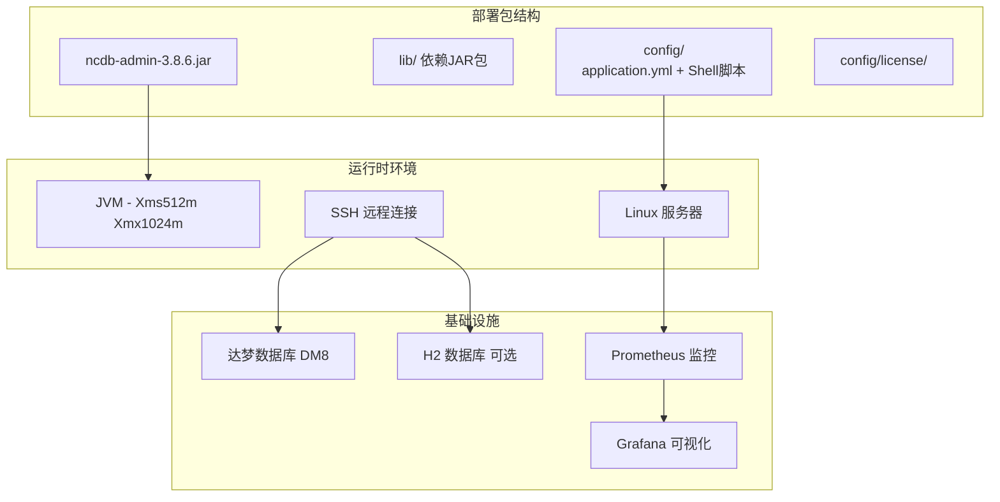
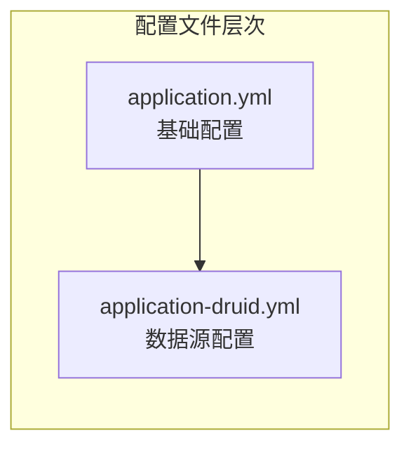

# 部署与运维指南

**本文档中引用的文件**
- [README.md](../../README.md)
- [pom.xml](../../pom.xml)
- [application.yml](../../ncdb-admin/src/main/resources/application.yml)
- [application-druid.yml](../../ncdb-admin/src/main/resources/application-druid.yml)
- [logback.xml](../../ncdb-admin/src/main/resources/logback.xml)
- [server.sh](../../config/server.sh)
- [device_monitor.sh](../../config/device_monitor.sh)
- [alarm_message.sh](../../config/alarm_message.sh)
- [createRootUser.sh](../../config/createRootUser.sh)
- [port_range.sh](../../config/port_range.sh)
- [write_file.sh](../../config/write_file.sh)
- [toml_write_file.sh](../../config/toml_write_file.sh)
- [encryptor.sh](../../config/encryptor/encryptor.sh)
- [pom.xml (ncdb-ui)](../../ncdb-ui/package.json)
- [run-web.bat](../../ncdb-ui/bin/run-web.bat)
- [build.bat](../../ncdb-ui/bin/build.bat)

## 目录
1. [概述](#概述)
2. [项目架构](#项目架构)
3. [环境配置管理](#环境配置管理)
4. [监控与日志](#监控与日志)
5. [故障排查指南](#故障排查指南)
6. [运维最佳实践](#运维最佳实践)

## 概述

本指南详细介绍了 manager（ncdb）管理系统的部署与运维流程。该系统采用单体架构（Monolithic）构建，基于 Spring Boot 2.6.15 + JDK 17 技术栈，依赖达梦数据库 DM8，支持多环境部署，通过 SSH 远程执行 Shell 脚本进行设备管理。

项目的核心特性包括：
- 基于 Spring Boot 2.6.15 的企业级应用架构，详见 [pom.xml](../../pom.xml)
- 支持达梦数据库 DM8 的高可用配置，详见 [application-druid.yml](../../ncdb-admin/src/main/resources/application-druid.yml)
- SSH 远程调用 Shell 脚本执行设备操作
- 多环境配置管理（Spring Profile 机制）
- 基于 Prometheus + Grafana 的监控体系
- 日志文件自动滚动与清理机制

## 项目架构



**图表来源**
- [README.md](../../README.md)(L1-L8)
- [pom.xml](../../pom.xml)(L32-L38)

## 环境配置管理

### 多环境配置结构

项目采用 Spring Boot Profile 机制管理不同环境配置，主配置文件为 `application.yml`，通过 `spring.profiles.active: druid` 激活数据源配置。



**图表来源**
- [application.yml](../../ncdb-admin/src/main/resources/application.yml)(L50-L56)
- [application-druid.yml](../../ncdb-admin/src/main/resources/application-druid.yml)

### 关键配置项

#### 服务器配置

后端服务端口为 **1081**，Tomcat 配置如下（来源：[application.yml](../../ncdb-admin/src/main/resources/application.yml)(L17-L32)）：

```yaml
server:
  port: 1081
  servlet:
    context-path: /
  tomcat:
    uri-encoding: UTF-8
    accept-count: 1000
    threads:
      max: 800
      min-spare: 100
```

#### 数据库连接配置

项目使用达梦数据库 DM8，通过 Druid 连接池管理（来源：[application-druid.yml](../../ncdb-admin/src/main/resources/application-druid.yml)）：

```yaml
spring:
  datasource:
    druid:
      stat-view-servlet:
        enabled: true
        loginUsername: admin
        loginPassword: 123456
    dynamic:
      druid:
        initial-size: 5
        min-idle: 5
        maxActive: 20
        maxWait: 60000
        validationQuery: SELECT 1 FROM DUAL
      datasource:
        master:
          driver-class-name: dm.jdbc.driver.DmDriver
          url: jdbc:dm://localhost:5236?schema=TEST_SCAFFOLD
          username: SYSDBA
          password: Dameng@8888
```

> 密码已脱敏处理，实际密码请根据环境配置。

#### JVM 内存配置

根据 [server.sh](../../config/server.sh)(L7) 脚本中的配置：

```bash
JVM_OPTS="-Dfile.encoding=utf-8 -Xms512m -Xmx1024m -XX:MetaspaceSize=128m -XX:MaxMetaspaceSize=512m"
```

#### SSH 远程连接配置

项目通过 SSH 免密登录远程管理服务器，配置在 [application.yml](../../ncdb-admin/src/main/resources/application.yml)(L163-L186)：

```yaml
ssh:
  idRsaPathLinux: /root/.ssh/id_rsa
  idRsaPathWin: C:\Users\DAMENG\.ssh\id_rsa
  maxTotal: 10000
  maxTotalPerKey: 500
  maxIdlePerKey: 10000
  minIdlePerKey: 20
  isBlockWhenExhausted: true
  minEvictableIdleTime: 30
  timeBetweenEvictionRuns: 30
```

#### 资源限制配置

根据 [application.yml](../../ncdb-admin/src/main/resources/application.yml)(L151-L162)：

```yaml
serviceSize:
  memResource: 8        # 单个实例需要内存 8GB
  diskResource: 20      # 单个实例需要磁盘 20GB
  resource: 256         # 单个实例需要内存 256M
  reserve: 256          # 系统预留内存 256M
  reserveDisk: 10240    # 系统预留磁盘 10240M
```

## 监控与日志

### 日志配置

项目使用 Logback 作为日志框架，配置文件位于 [logback.xml](../../ncdb-admin/src/main/resources/logback.xml)：

```xml
<configuration>
  <property name="log.path" value="./logs/ncdb-admin" />
  <property name="log.pattern" value="%d{HH:mm:ss.SSS} [%thread] %-5level %logger{20} - [%method,%line] - %msg%n" />
</configuration>
```

**日志文件说明：**

| 日志文件 | 路径 | 说明 |
|---------|------|------|
| 系统信息日志 | `${log.path}/sys-info.log` | 记录 INFO 级别系统日志 |
| 系统错误日志 | `${log.path}/sys-error.log` | 记录 ERROR 级别系统日志 |
| 用户操作日志 | `${log.path}/sys-user.log` | 记录用户操作行为日志 |

**日志滚动策略：**
- 基于时间滚动（按天），文件名格式 `sys-info.%d{yyyy-MM-dd}.%i.log`
- 单个日志文件最大 500MB
- 日志最多保留 30 天
- 日志总大小限制 5GB
- 项目启动时自动清理历史日志

### 远程服务器监控脚本

项目提供完整的设备监控脚本 [device_monitor.sh](../../config/device_monitor.sh)，通过 SSH 远程执行采集以下指标：

**CPU 监控：**
- 读取 `/proc/stat` 文件计算 CPU 使用率
- 获取 CPU 核心数

**内存监控：**
- 内存使用率百分比
- 内存总量、已用量、剩余量

**网络监控：**
- 网卡流量统计（入流量、出流量）
- 通过 `/proc/net/dev` 获取数据

**磁盘监控：**
- 磁盘使用率
- 磁盘 I/O 指标（通过 iostat 命令获取）

### Prometheus 监控集成

根据 [application.yml](../../ncdb-admin/src/main/resources/application.yml)(L192-L207) 配置的 Prometheus 监控：

```yaml
prometheus:
  path: /opt/prometheus
  decompressTime: 30
  startTime: 30
  grafanaExposeIp: 10.14.1.149
  userList:
    - userName: manager
      prometheusPort: 11112
      grafanaPort: 22223
      exporterPort: 33334
```

### 邮件告警配置

项目内置邮件告警功能，配置在 [application.yml](../../ncdb-admin/src/main/resources/application.yml)(L71-L83)：

```yaml
spring:
  mail:
    host: 10.166.20.201
    port: 25
    username: yth@jsdameng.com
    default-encoding: utf-8
```

> 密码已脱敏处理。

## 故障排查指南

### 常见问题诊断

#### 1. 应用启动失败

**症状**: 应用启动后立即退出
**排查步骤**:
```bash
# 查看应用日志
tail -f ./logs/ncdb-admin/sys-error.log

# 检查 JVM 进程
ps -ef | grep ncdb-admin-3.8.6.jar

# 验证数据库连接
telnet localhost 5236
```

#### 2. 数据库连接问题

**症状**: 应用无法连接达梦数据库
**排查步骤**:
```bash
# 检查达梦数据库服务状态
systemctl status DmServiceDMSERVER

# 验证网络连通性
ping localhost

# 检查数据库配置
cat /opt/ncdb-admin/config/application.yml | grep -A 10 datasource
```

#### 3. SSH 连接问题

**症状**: 远程设备管理失败
**排查步骤**:
```bash
# 测试 SSH 免密登录
ssh -i /root/.ssh/id_rsa root@<target_ip>

# 检查 SSH 密钥权限
chmod 600 /root/.ssh/id_rsa

# 检查 SSH 服务状态
systemctl status sshd
```

#### 4. 内存不足问题

**症状**: 应用频繁崩溃或响应缓慢
**排查步骤**:
```bash
# 检查系统内存使用
free -h

# 查看 JVM 堆内存使用
jstat -gc <pid>

# 检查容器资源使用
top -p <pid>
```

## 运维最佳实践

### 1. 部署前准备

#### 环境检查清单
- [ ] JDK 17 已安装并配置环境变量
- [ ] 达梦数据库 DM8 服务正常
- [ ] SSH 免密登录已配置
- [ ] 网络连通性测试通过
- [ ] 磁盘空间充足（至少 20GB）

#### 依赖安装

根据 [README.md](../../README.md)(L11-L12) 及 [pom.xml](../../pom.xml)(L121-L122) 中的说明，执行以下命令安装本地依赖：

```bash
# 安装 dm-framework 依赖
mvn install:install-file -Dfile=<项目根目录>/dm-framework/1.0.50/dm-framework-1.0.50.pom \
  -DgroupId=com.dm.framework -DartifactId=dm-framework -Dversion=1.0.50 -Dpackaging=pom

# 安装 dm-framework-common 依赖
mvn install:install-file -Dfile=<项目根目录>/framework/dm-framework-common/1.0.50/dm-framework-common-1.0.50.jar \
  -DgroupId=com.dm.framework -DartifactId=dm-framework-common -Dversion=1.0.50 -Dpackaging=jar
```

#### 数据库初始化

根据 [README.md](../../README.md)(L13) 说明，按顺序执行 SQL 脚本：

```bash
# 1. 初始化数据库结构
mysql -u SYSDBA -p < doc/initDM.sql

# 2. 初始化基础数据
mysql -u SYSDBA -p < doc/initDMData.sql

# 3. 开发环境数据（可选）
mysql -u SYSDBA -p < doc/initDM-DevEnv.sql
```

### 2. 应用部署

#### 后端部署

根据 [README.md](../../README.md)(L16-L23) 部署说明：

```bash
# 1. 上传部署包到 Linux 服务器
scp ncdb-admin-package.tar.gz root@<server_ip>:/opt/

# 2. 解压部署包
tar -zxvf ncdb-admin-package.tar.gz

# 3. 解压后目录结构
# ncdb-admin/
#  ├── lib/           # 项目依赖 JAR 包
#  ├── config/
#  │   ├── application.yml
#  │   └── license/   # License 文件
#  └── ncdb-admin-3.8.6.jar

# 4. 启动应用
./config/server.sh start

# 5. 查看应用状态
./config/server.sh status
```

#### 前端部署

根据 [ncdb-ui/bin/build.bat](../../ncdb-ui/bin/build.bat) 和 [ncdb-ui/package.json](../../ncdb-ui/package.json) 的说明：

```bash
# 安装依赖
yarn install

# 构建生产环境
yarn build:prod

# 构建测试环境
yarn build:stage
```

### 3. 应用生命周期管理

使用 [server.sh](../../config/server.sh) 脚本管理应用服务：

```bash
# 启动应用
./config/server.sh start

# 停止应用
./config/server.sh stop

# 重启应用
./config/server.sh restart

# 查看状态
./config/server.sh status
```

### 4. 日常维护任务

#### 定期任务清单
- [ ] 每日检查应用健康状态：`curl http://localhost:1081/actuator/health`
- [ ] 每日检查日志文件大小
- [ ] 每周清理过期日志（系统自动清理，保留 30 天）
- [ ] 每月检查磁盘空间
- [ ] 每季度检查 SSL 证书有效期

#### 日志管理

根据 [logback.xml](../../ncdb-admin/src/main/resources/logback.xml) 的日志滚动策略，系统会自动：
- 按天分割日志文件
- 单个日志文件最大 500MB
- 日志保留 30 天
- 总日志大小限制 5GB
- 项目启动时自动清理历史日志

### 5. 安全加固措施

#### 网络安全
- 应用端口 1081 仅在防火墙白名单中开放
- 数据源监控页面（Druid）需登录访问（admin/123456）
- SSH 免密登录使用专用密钥，确保密钥权限为 600
- 达梦数据库默认端口 5236 限制访问来源

#### 访问控制
- 使用 Token 认证机制，默认 300 分钟过期
- 密码错误 5 次后锁定 10 分钟
- 支持 CAS 单点登录集成（可选）

#### 敏感信息加密
项目使用 Jasypt 进行数据源密码加密，配置见 [application.yml](../../ncdb-admin/src/main/resources/application.yml)(L234-L238)：

```yaml
jasypt:
  encryptor:
    algorithm: PBEWithMD5AndDES
    iv-generator-classname: org.jasypt.iv.NoIvGenerator
```

加密工具位于 [config/encryptor/](../../config/encryptor/)：

```bash
# 使用 Jasypt 加密敏感信息
java -jar config/encryptor/jasypt-1.9.3.jar input=<明文密码> password=<加密密钥> algorithm=PBEWithMD5AndDES
```

### 6. 版本升级

根据 [README.md](../../README.md)(L7) 说明，系统设备脚本升级通过修改 `application.yml` 中的 `manager.version` 版本号实现自动更新：

```yaml
manager:
  version: V22.0-20250929-3685ffa8
```

修改版本号后，系统会自动通过 Shell 脚本远程更新设备端脚本。

### 7. 故障恢复流程

#### 应急响应流程
1. **故障发现**: 监控告警触发
2. **影响评估**: 检查应用日志和系统资源
3. **应急处理**: 重启应用或回滚版本
4. **根因分析**: 深入分析日志和应用状态
5. **预防措施**: 优化配置或扩容

#### 回滚操作
```bash
# 停止当前应用
./config/server.sh stop

# 替换为旧版本 JAR 包
cp /backup/ncdb-admin-<old_version>.jar /opt/ncdb-admin/

# 启动应用
./config/server.sh start

# 验证应用状态
./config/server.sh status
```

#### 数据恢复
```bash
# 恢复数据库备份
./disql SYSDBA/Dameng@8888@localhost:5236 < /backup/restore.sql

# 重启应用服务
./config/server.sh restart
```

通过遵循这些最佳实践和故障排查指南，运维团队可以确保系统的稳定运行和快速故障恢复。定期的维护和监控是保障系统可靠性的关键。