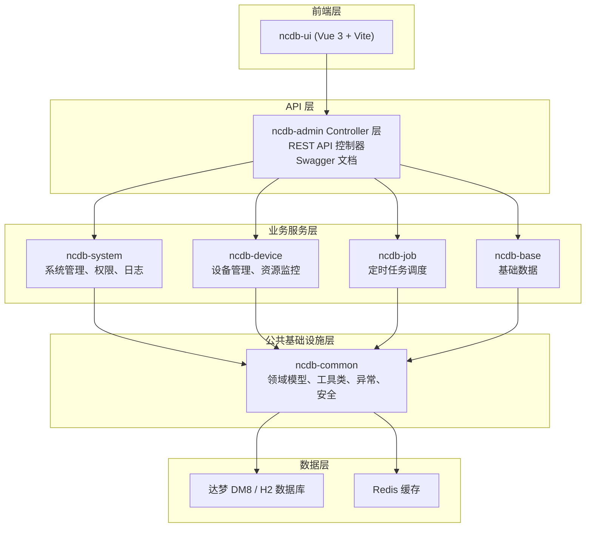

# 项目概述

**本文档引用的文件**  
- [README.md](../../README.md)  
- [NcdbApplication.java](../../ncdb-admin/src/main/java/com/dm/cn/NcdbApplication.java)  
- [application.yml](../../ncdb-admin/src/main/resources/application.yml)  
- [application-druid.yml](../../ncdb-admin/src/main/resources/application-druid.yml)  
- [pom.xml](../../pom.xml)  
- [ncdb-admin 控制器目录](../../ncdb-admin/src/main/java/com/dm/cn/controller/)  
- [ncdb-system 模块目录](../../ncdb-system/src/main/java/com/dm/cn/system/)  
- [ncdb-common 模块目录](../../ncdb-common/src/main/java/com/dm/cn/common/)  
- [ncdb-device 模块目录](../../ncdb-device/src/main/java/com/dm/cn/device/)  
- [ncdb-ui 前端目录](../../ncdb-ui/)

## 目录
1. [简介](#简介)  
2. [项目结构](#项目结构)  
3. [核心组件](#核心组件)  
4. [架构概述](#架构概述)  
5. [详细组件分析](#详细组件分析)  
6. [依赖分析](#依赖分析)  
7. [性能考虑](#性能考虑)  
8. [故障排除指南](#故障排除指南)  
9. [结论](#结论)

## 简介

- **项目名称**：NCDB 管理系统（manager）
- **项目定位**：基于 Spring Boot 单体架构的达梦数据库设备管理与运维监控系统，支持 SSH 远程操作、资源监控、告警管理等功能。来源：[README.md](../../README.md)、[pom.xml](../../pom.xml)
- **核心特性**：
  1. **单体架构，易维护易部署** — 采用单体架构模型，简化部署与运维流程。来源：[README.md](../../README.md)
  2. **SSH 远程操作与 Shell 脚本执行** — 通过 SSH 远程调用设备 Shell 脚本，实现设备配置、升级与监控。来源：[README.md](../../README.md)、[application.yml](../../ncdb-admin/src/main/resources/application.yml)
  3. **达梦数据库（DM8）支持** — 使用达梦数据库作为主存储，通过 MyBatis-Plus 进行数据访问。来源：[application-druid.yml](../../ncdb-admin/src/main/resources/application-druid.yml)
  4. **设备全生命周期管理** — 支持设备注册、节点管理、资源监控、告警配置等。来源：[ncdb-device 模块](../../ncdb-device/src/main/java/com/dm/cn/device/)
  5. **CAS 单点登录集成** — 支持 CAS 认证协议，可通过配置开启。来源：[application.yml](../../ncdb-admin/src/main/resources/application.yml)
  6. **Prometheus 监控集成** — 内置 Prometheus 与 Grafana 监控组件管理能力。来源：[application.yml](../../ncdb-admin/src/main/resources/application.yml)
- **技术栈**：
  - **后端框架**：Spring Boot 2.6.15、Spring Security、Spring AOP — 来源：[NcdbApplication.java](../../ncdb-admin/src/main/java/com/dm/cn/NcdbApplication.java)、[pom.xml](../../pom.xml)
  - **ORM 框架**：MyBatis-Plus（含分页插件） — 来源：[NcdbApplication.java](../../ncdb-admin/src/main/java/com/dm/cn/NcdbApplication.java)
  - **数据库**：达梦 DM8（主库）、H2（可选嵌入式模式） — 来源：[application-druid.yml](../../ncdb-admin/src/main/resources/application-druid.yml)
  - **中间件**：Druid 连接池、Redis（缓存相关）、JWT Token 认证 — 来源：[pom.xml](../../pom.xml)、[application.yml](../../ncdb-admin/src/main/resources/application.yml)
  - **前端**：Vue 3 + Vite — 来源：[ncdb-ui 目录](../../ncdb-ui/)
  - **其他**：Jasypt 配置加密、Swagger 2 API 文档、PageHelper 分页、POI Excel 处理 — 来源：[pom.xml](../../pom.xml)、[application.yml](../../ncdb-admin/src/main/resources/application.yml)
  - **Java 版本**：17 — 来源：[pom.xml](../../pom.xml)

## 项目结构

```
dameng (com.dameng:manager:3.8.6)
├── ncdb-admin              # 主应用模块（Web 入口、控制器）
│   └── src/main/java/com/dm/cn/
│       ├── NcdbApplication.java   # 启动类
│       ├── config/                 # Jasypt、Swagger 配置
│       └── controller/             # 控制器层
│           ├── base/               # 基础管理（告警、消息等）
│           ├── device/             # 设备管理
│           └── system/             # 系统管理（用户、角色、权限等）
├── ncdb-system             # 系统业务模块
│   └── src/main/java/com/dm/cn/system/
│       ├── config/                 # 安全配置、资源配置、日志切面
│       ├── entity/                 # 实体类（参数、服务端实体、VO）
│       ├── mapper/                 # MyBatis 映射接口
│       ├── service/                # 业务逻辑服务
│       └── constant/               # 消息常量
├── ncdb-common             # 公共工具模块
│   └── src/main/java/com/dm/cn/common/
│       ├── annotation/             # 自定义注解
│       ├── cache/                  # 缓存工具
│       ├── config/                 # 通用配置（验证码、过滤器、线程池等）
│       ├── core/                   # 核心领域（用户、角色、菜单、部门等）
│       ├── enums/                  # 枚举定义
│       ├── exception/              # 异常体系
│       ├── filter/                 # 过滤器（XSS、重复请求）
│       ├── log/                    # 日志注解
│       ├── param/                  # 通用参数对象
│       ├── security/               # 安全注解与工具
│       ├── task/                   # 任务常量与模型
│       └── utils/                  # 工具类（SSH、文件、IP、服务器监控等）
├── ncdb-device             # 设备管理模块
│   └── src/main/java/com/dm/cn/device/
│       ├── entity/                 # 设备实体、枚举、参数、VO
│       ├── mapper/                 # 设备数据映射
│       └── service/                # 设备服务（初始化、节点管理、SSH）
├── ncdb-base               # 基础模块
├── ncdb-job                # 定时任务模块
└── ncdb-ui                 # 前端项目（Vue 3 + Vite）
    ├── src/
    │   ├── api/                   # API 接口（login, menu, device, job 等）
    │   ├── views/                 # 视图页面
    │   ├── components/            # 公共组件
    │   ├── router/                # 路由配置
    │   └── store/                 # 状态管理
    └── vite.config.js            # Vite 构建配置
```

### 本节来源
- [pom.xml](../../pom.xml)（模块声明）
- [README.md](../../README.md)
- 各模块目录结构

## 核心组件

| 模块 | 职责 | 来源 |
|------|------|------|
| **ncdb-admin** | 应用主入口，提供 REST API 控制器，协调各模块请求分发 | [NcdbApplication.java](../../ncdb-admin/src/main/java/com/dm/cn/NcdbApplication.java)、[controller 目录](../../ncdb-admin/src/main/java/com/dm/cn/controller/) |
| **ncdb-system** | 系统核心业务：用户管理、角色权限、部门管理、字典管理、操作日志、登录认证、菜单路由、安全配置（Spring Security + JWT + CAS） | [ncdb-system 目录](../../ncdb-system/src/main/java/com/dm/cn/system/) |
| **ncdb-common** | 公共基础设施：核心领域模型（用户、角色、菜单、部门）、通用工具类（SSH、文件、IP、服务器监控、SQL 工具）、异常体系、枚举、自定义注解、过滤器（XSS、重复提交）、安全注解、国际化支持 | [ncdb-common 目录](../../ncdb-common/src/main/java/com/dm/cn/common/) |
| **ncdb-device** | 设备管理：设备注册与发现、节点管理、资源监控、SSH 远程执行、设备初始化 | [ncdb-device 目录](../../ncdb-device/src/main/java/com/dm/cn/device/) |
| **ncdb-base** | 基础模块（提供基础数据与配置支持） | 根据模块命名推断 |
| **ncdb-job** | 定时任务调度（如域用户同步任务 `DomainUserSyncJob`） | [ncdb-job 目录](../../ncdb-job/)、[DomainUserSyncJob.java](../../ncdb-system/src/main/java/com/dm/cn/system/service/job/DomainUserSyncJob.java) |
| **ncdb-ui** | 前端用户界面，基于 Vue 3 构建，提供设备管理、系统监控、告警查看等可视化操作 | [ncdb-ui 目录](../../ncdb-ui/) |

### 本节来源
- [ncdb-admin 控制器目录](../../ncdb-admin/src/main/java/com/dm/cn/controller/)
- [ncdb-system 模块目录](../../ncdb-system/src/main/java/com/dm/cn/system/)
- [ncdb-common 模块目录](../../ncdb-common/src/main/java/com/dm/cn/common/)
- [ncdb-device 模块目录](../../ncdb-device/src/main/java/com/dm/cn/device/)
- [ncdb-ui 目录](../../ncdb-ui/)

## 架构概述

根据 [README.md](../../README.md) 中的说明，系统采用 **单体架构（Monolithic Architecture）**，具有易维护、易部署的特点。整体架构分层如下：



**架构说明：**
- 单体架构，所有模块在同一 JVM 进程中运行，通过包层级划分模块边界
- 前端通过 REST API 与后端交互，API 由 Swagger 2 文档化管理
- 所有业务模块依赖 ncdb-common 提供的基础设施（领域模型、工具类、异常处理等）
- 数据持久化主要使用达梦 DM8 数据库，通过 MyBatis-Plus 进行 ORM 映射
- 认证授权由 Spring Security + JWT 实现，可选 CAS 单点登录集成

### 本节来源
- [README.md](../../README.md)
- 项目目录结构
- [NcdbApplication.java](../../ncdb-admin/src/main/java/com/dm/cn/NcdbApplication.java)

## 详细组件分析

### 系统管理模块（ncdb-system）

- **职责**：用户认证与授权、角色权限管理、部门管理、字典管理、操作日志记录、系统配置、菜单路由管理、用户在线状态管理。来源：[ncdb-system 目录](../../ncdb-system/src/main/java/com/dm/cn/system/)
- **安全架构**：基于 Spring Security + JWT 令牌认证，支持 CAS 单点登录；通过 `@PreAuthorize` 注解进行方法级权限控制。来源：[security 配置](../../ncdb-system/src/main/java/com/dm/cn/system/config/security/)
- **领域模型**：`SysUser`、`SysRole`、`SysMenu`、`SysDept`、`SysDictData`、`SysDictType`、`SysConfig`、`SysOperLog`、`SysLogininfor`、`SysDomain` 等。来源：[ncdb-common 核心领域](../../ncdb-common/src/main/java/com/dm/cn/common/core/domain/)
- **支持服务**：`SysUserServiceImpl`、`SysRoleServiceImpl`、`SysMenuServiceImpl`、`SysLoginService`、`SysPermissionServiceImpl` 等。来源：[service 实现目录](../../ncdb-system/src/main/java/com/dm/cn/system/service/impl/)

### 设备管理模块（ncdb-device）

- **职责**：设备注册、节点管理、设备资源监控、SSH 远程命令执行、设备初始化。来源：[ncdb-device 目录](../../ncdb-device/src/main/java/com/dm/cn/device/)
- **领域模型**：`Device`（设备）、`DeviceNode`（设备节点）。来源：[device 实体目录](../../ncdb-device/src/main/java/com/dm/cn/device/entity/server/)
- **核心服务**：`DeviceServiceImpl`（设备管理）、`DeviceNodeServiceImpl`（节点管理）、`SshdServiceImpl`（SSH 远程执行）。来源：[device 服务目录](../../ncdb-device/src/main/java/com/dm/cn/device/service/impl/)
- **远程操作**：通过 SSH 协议远程执行 Shell 脚本，支持设备配置升级、脚本执行、端口扫描等操作。来源：[application.yml](../../ncdb-admin/src/main/resources/application.yml)
- **监控指标**：设备资源使用情况（CPU、内存、磁盘、网络）、实例数量统计、设备拓扑图数据。来源：[device VO 目录](../../ncdb-device/src/main/java/com/dm/cn/device/entity/vo/)

### 公共基础设施模块（ncdb-common）

- **职责**：为全系统提供通用工具类、核心领域模型、异常体系、枚举、安全注解、过滤器、国际化支持。来源：[ncdb-common 目录](../../ncdb-common/src/main/java/com/dm/cn/common/)
- **核心工具类**：
  - SSH 工具：`SshExecUtil`、`SshBuilderConfig`，支持 SSH 连接池管理。来源：[ssh 工具目录](../../ncdb-common/src/main/java/com/dm/cn/common/utils/ssh/)
  - 服务器监控：`Server`、`Cpu`、`Mem`、`Jvm`、`Sys`、`NetWork`、`DiskIo`。来源：[server 工具目录](../../ncdb-common/src/main/java/com/dm/cn/common/utils/server/)
  - 文件处理：`FileUtils`、`IoUtils`、POI Excel 工具。来源：[file 工具目录](../../ncdb-common/src/main/java/com/dm/cn/common/core/utils/file/)
  - IP 与地址工具：`IpUtils`、`AddressUtils`。来源：[ip 工具目录](../../ncdb-common/src/main/java/com/dm/cn/common/utils/ip/)
- **安全注解**：`@RequiresPermissions`、`@RequiresRoles`、`@RequiresLogin`、`@InnerAuth`（内部认证）。来源：[security 注解目录](../../ncdb-common/src/main/java/com/dm/cn/common/security/annotation/)
- **过滤器**：XSS 过滤、重复提交过滤、请求包装器。来源：[filter 目录](../../ncdb-common/src/main/java/com/dm/cn/common/filter/)
- **配置支持**：验证码生成（Kaptcha）、线程池配置、CAS 属性配置、NcdbApi 配置。来源：[config 目录](../../ncdb-common/src/main/java/com/dm/cn/common/config/)

### 本节来源
- [ncdb-system 模块目录](../../ncdb-system/src/main/java/com/dm/cn/system/)
- [ncdb-device 模块目录](../../ncdb-device/src/main/java/com/dm/cn/device/)
- [ncdb-common 模块目录](../../ncdb-common/src/main/java/com/dm/cn/common/)
- [application.yml](../../ncdb-admin/src/main/resources/application.yml)

## 依赖分析

| 依赖类型 | 名称 | 配置线索 | 来源 |
|---------|------|---------|------|
| **数据库** | 达梦 DM8（主库） | `jdbc:dm://localhost:5236?schema=TEST_SCAFFOLD`，驱动：`dm.jdbc.driver.DmDriver` | [application-druid.yml](../../ncdb-admin/src/main/resources/application-druid.yml) |
| **数据库** | H2（可选嵌入式模式） | 配置中被注释，可用于开发测试 | [application-druid.yml](../../ncdb-admin/src/main/resources/application-druid.yml) |
| **连接池** | Druid 1.2.16 | 配置了初始连接数、最大活跃数、等待超时等参数 | [pom.xml](../../pom.xml)、[application-druid.yml](../../ncdb-admin/src/main/resources/application-druid.yml) |
| **缓存** | Redis（通过缓存工具类） | `ExpiringCacheMap` 缓存工具类，部分服务使用缓存 | [ncdb-common cache 目录](../../ncdb-common/src/main/java/com/dm/cn/common/cache/) |
| **消息/邮件** | JavaMail | 配置了 SMTP 服务器（10.166.20.201:25），用于邮件通知 | [application.yml](../../ncdb-admin/src/main/resources/application.yml) |
| **认证** | JWT Token | 令牌有效期 300 分钟，使用自定义密钥签名 | [application.yml](../../ncdb-admin/src/main/resources/application.yml) |
| **认证** | CAS 单点登录 | 可选集成，通过 `app.casEnable: false` 控制开关 | [application.yml](../../ncdb-admin/src/main/resources/application.yml) |
| **配置加密** | Jasypt | `PBEWithMD5AndDES` 算法，用于数据源密码等敏感配置加密 | [NcdbApplication.java](../../ncdb-admin/src/main/java/com/dm/cn/NcdbApplication.java)、[application.yml](../../ncdb-admin/src/main/resources/application.yml) |
| **监控** | Prometheus + Grafana | 内置 Prometheus 管理配置，支持容器化部署，暴露端口管理 | [application.yml](../../ncdb-admin/src/main/resources/application.yml) |
| **API 文档** | Swagger 2 | 通过 `@EnableSwagger2` 开启，配置路径映射 `/dev-api` | [NcdbApplication.java](../../ncdb-admin/src/main/java/com/dm/cn/NcdbApplication.java)、[application.yml](../../ncdb-admin/src/main/resources/application.yml) |
| **分页** | PageHelper 1.4.6 | `helperDialect: mysql`，兼容达梦数据库 | [pom.xml](../../pom.xml)、[application.yml](../../ncdb-admin/src/main/resources/application.yml) |
| **Excel** | Apache POI 5.2.1 | 用于数据导出功能 | [pom.xml](../../pom.xml) |
| **验证码** | Kaptcha 2.3.3 | 支持数学计算和字符验证码两种模式 | [pom.xml](../../pom.xml)、[application.yml](../../ncdb-admin/src/main/resources/application.yml) |

### 本节来源
- [application.yml](../../ncdb-admin/src/main/resources/application.yml)
- [application-druid.yml](../../ncdb-admin/src/main/resources/application-druid.yml)
- [pom.xml](../../pom.xml)
- [NcdbApplication.java](../../ncdb-admin/src/main/java/com/dm/cn/NcdbApplication.java)

## 性能考虑

- **Tomcat 线程池优化**：最大线程数 800，最小空闲线程 100，连接排队数 1000，适合中等并发场景。来源：[application.yml](../../ncdb-admin/src/main/resources/application.yml)
- **Druid 连接池配置**：初始连接 5，最小空闲 5，最大活跃 20，连接等待超时 60 秒，开启预处理语句缓存。来源：[application-druid.yml](../../ncdb-admin/src/main/resources/application-druid.yml)
- **SSH 连接池配置**：最大连接数 10000，每个 key 最大 500，空闲连接回收机制，30 分钟剔除空闲连接。来源：[application.yml](../../ncdb-admin/src/main/resources/application.yml)
- **异步任务框架**：通过 `AsyncManager` 和 `ThreadPoolConfig` 配置线程池，支持异步操作。来源：[ncdb-common 线程池配置](../../ncdb-common/src/main/java/com/dm/cn/common/config/manager/ThreadPoolConfig.java)
- **文件上传限制**：单文件最大 10GB，适用于大文件传输场景。来源：[application.yml](../../ncdb-admin/src/main/resources/application.yml)
- **资源限制配置**：单实例服务内存 8GB、磁盘 20GB，系统预留资源可调。来源：[application.yml](../../ncdb-admin/src/main/resources/application.yml)

### 本节来源
- [application.yml](../../ncdb-admin/src/main/resources/application.yml)
- [application-druid.yml](../../ncdb-admin/src/main/resources/application-druid.yml)
- [ncdb-common 线程池配置](../../ncdb-common/src/main/java/com/dm/cn/common/config/manager/)

## 故障排除指南

- **日志位置**：后端日志生成路径为 `/home/ncdb-admin/logs`（Linux 部署环境）。来源：[README.md](../../README.md)
- **日志级别配置**：`com.dm.cn.base` 和 `com.dm.cn.system` 包日志级别为 `debug`，`org.springframework` 为 `warn`。来源：[application.yml](../../ncdb-admin/src/main/resources/application.yml)
- **数据库连接验证**：连接池配置了 `validationQuery: SELECT 1 FROM DUAL`，空闲连接会定期验证可用性。来源：[application-druid.yml](../../ncdb-admin/src/main/resources/application-druid.yml)
- **密码错误锁定**：密码错误超过 5 次将锁定 10 分钟。来源：[application.yml](../../ncdb-admin/src/main/resources/application.yml)
- **健康检查提示**：启动类中通过日志输出启动成功信息，并打印 ASCII 艺术字标识。来源：[NcdbApplication.java](../../ncdb-admin/src/main/java/com/dm/cn/NcdbApplication.java)
- **启动前准备**：
  1. 执行 `mvn install:install-file` 安装本地框架依赖（dm-framework）
  2. 按顺序执行 SQL 脚本：`initDM.sql` → `initDMData.sql` → `initDM-DevEnv.sql`（开发环境）
  3. 确保达梦数据库服务运行正常，连接配置正确

### 本节来源
- [application.yml](../../ncdb-admin/src/main/resources/application.yml)
- [README.md](../../README.md)
- [NcdbApplication.java](../../ncdb-admin/src/main/java/com/dm/cn/NcdbApplication.java)

## 结论

- **NCDB 管理系统** 是一个基于 Spring Boot 2.6.15 的单体架构应用，采用达梦 DM8 数据库作为主存储，面向设备管理与运维监控场景。
- **技术选型成熟稳定**：后端采用 Spring Boot + MyBatis-Plus + Spring Security 的主流技术栈，前端使用 Vue 3 + Vite 现代前端框架，数据库选用达梦 DM8 满足国产化需求。
- **功能覆盖全面**：涵盖设备管理、系统管理（用户/角色/权限）、定时任务、告警通知、操作日志、系统监控等企业级管理功能，并提供 SSH 远程操作和 Prometheus 监控集成能力。
- **部署运维友好**：单体架构简化了部署复杂度，支持 Linux 环境部署，通过配置文件可灵活调整性能参数，内置 CAS 单点登录支持企业级认证集成。